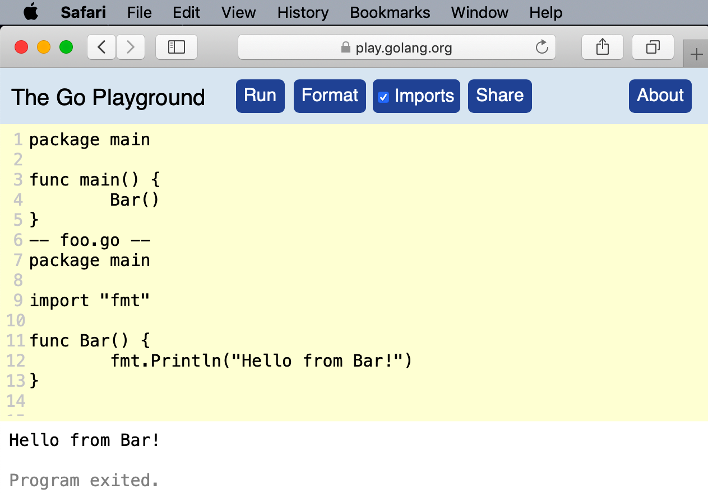

# Setting up your Go environment

## Installing the Go Tools

To write Go code, you first need to [download](https://golang.org/dl) and install the Go development tools.

```shell
tar -C /usr/local -xzf go1.15.2.linux-amd64.tar.gz
echo 'export PATH=$PATH:/usr/local/go/bin' >> $HOME/.profile
source $HOME/.profile
```

## The Go Workspace

You are free to organize your projects as you see fit. However, Go still expects there to be a single workspace for
third-party Go tools installed via ``go install``.

By default, this workspace is located in ``$HOME/go``, with source code with these tools stored in ``$HOME/go/src`` and
the compiled binaries in ``$HOME/go/bin``. You can use this default or specify a different workspace by setting the
``$GOPATH`` environment variable.

> Some online resources tell you to set the ``$GOROOT`` environment variable.
> This variable specifies the location where your Go development environment is installed.
> This is no longer necessary; the go tool figures this out automatically.

Whether or not you use the default location, it’s a good idea to explicitly define ``GOPATH`` and to put the
``$GOPATH/bin`` directory in your executable path. Explicitly defining ``GOPATH`` makes it clear where your Go workspace
is located and adding ``$GOPATH/bin`` to your executable path makes it easier to run third-party tools installed
via ``go install``.

If you are on a Unix-like system using bash , add the following lines to your .profile.

```shell
export GOPATH=$HOME/go
export PATH=$PATH:$GOPATH/bin
```

You can get a complete list, along with a brief description of each variable, using the ``go env`` command.

## The Go Command

There are two similar commands available via Go: ``go run`` and ``go build``. Each takes either a single Go file, a list
of Go files, or the name of a package.

### go run

The ``go run`` command does in fact compile your code into a binary. However, the binary is built in a temporary
directory. The ``go run`` command builds the binary, executes the binary from that temporary directory, and then deletes
the binary after your program finishes.

```shell
go run hello.go
```

### go build

If you want a different name for your application, or if you want to store it in a different location, use the `-o`
flag.

```shell
go build -o hello_world hello.go
```

## Getting Third-Party Go Tools

Go developers don’t rely on a centrally hosted service, like Maven Central for Java or the NPM registry for JavaScript.
Instead, they share projects via their source code repositories. The `go install` command takes an argument, which is
the location of the source code repository of the project, followed by an @ and the version of the tool you want.

```shell
go install github.com/rakyll/hey@0.1.4
```

This downloads hey and all of its dependencies, builds the program, and installs the binary in your `$GOPATH/bin`
directory.

If you want to update a tool to a newer version, rerun `go install` with the newer version specified or with `@latest`.

> As we’ll talk about in “Module Proxy Servers” on page 200, the contents of Go repositories are cached in proxy servers. Depending on the repository and the values in your `GOPROXY` environment variable,
`go install` may download from a proxy or directly from a repository. If `go install` downloads directly from a repository, it relies on command-line tools being installed on your computer. For example, you must have Git installed to download from GitHub.

## Formatting Your Code

`go fmt` automatically reformat your code to match the standard format.

There's an enhanced version of `go fmt` available called `goimports` that also cleans up your import statements. It puts
them in alphabetic order, removes unused imports, and attempts to guess any unspecified imports.

You can download `goimports` with the command `go install golang.org/x/tools/cmd/goimports@latest`.

You run it across your project with the command:

```shell
goimports -l -w .
```

- The -l flag tells it to print the files with incorrect formatting to the console.
- The -w flag tells it to modify the files in-place.
- The . specifies the files to be scanned: everything in the current directory and all of its subdirectories.

### The Semicolon Insertion Rule

The `go fmt` command won’t fix braces on the wrong line, because of the **semicolon insertion rule**. Like C or Java, Go
requires a semicolon at the end of every statement. However, Go developers never put the semicolons in themselves; the
Go compiler does it for them following a very simple rule described in Effective Go:

If the last token before a newline is any of the following, the lexer inserts a semicolon after the token:

- An identifier (which includes words like int and float64)
- A basic literal such as a number or string constant
- One of the tokens: “break”, “continue”, “fallthrough”, “return”, “++”, “--”, “)”, or “}” With this simple rule in
  place, you can see why putting a brace in the wrong place breaks. If you write your code like this:

```go
func main()
{
    fmt.Println("Hello, world!")
}
```

the semicolon insertion rule sees the “)” at the end of the func main() line and turns that into:

```go
func main();
{
    fmt.Println("Hello, world!");
};
```

and that’s not valid Go.

## Linting and Vetting

"Linter" comes from the Unix team at Bell Labs; the first linter was written in 1978.

You can't automatically assume that `golint` is 100% accurate: because the kinds of issues that `golint` finds are more
fuzzy, it sometimes has false positives and false negatives. This means that you don't have to make the changes
that `golint` suggests. But you should take the suggestions seriously.

Install `golint` with the following command:

```shell
go install golang.org/x/lint/golint@latest
```

And run it with:

```shell
golint ./...
```

That runs `golint` over your entire project.

> [Golint](https://github.com/golang/lint) is deprecated and frozen. There's no drop-in replacement for it, 
> but tools such as [Staticcheck](https://staticcheck.io/) and `go vet` should be used instead.

There is another class of errors that developers run into. The code is syntactically valid, but there are mistakes that
are not what you meant to do. This includes things like assigning values to variables that are never used.

```shell
go vet ./...
```

Rather than use separate tools, you can run multiple tools together with `golangci-lint`. Because `golangci-lint` runs
so many tools (as of this writing, it runs 10 different linters by default and allows you to enable another 50), it’s
inevitable that your team may disagree with some of its suggestions. You can configure which linters are enabled and
which files they analyze by including a file named `.golangci.yml`. Check out
the [documentation](https://golangci-lint.run/usage/configuration/) for the file format.

## Choose Your Tools

**Language server** is a standard specification for an API that enables editors to implement intelligent editing
behavior, like code completion, linting, and finding usages. You can check out
the [language server protocol](https://microsoft.github.io/language-server-protocol/).

### The Go Playground

You can even simulate multiple files by separating each file with a line that looks like `-- filename.go --`



## Makefiles

```
.DEFAULT_GOAL := build

fmt:
    go fmt ./...
.PHONY:fmt

lint: fmt
    golint ./...
.PHONY:lint

vet: fmt
    go vet ./...
.PHONY:vet

build: vet
    go build hello.go
.PHONY:build
```

Each possible operation is called a *target*. The `.DEFAULT_GOAL` defines which target is run when no target is
specified. The word before the colon is the name of the target. Any words after the target (like vet in the line build:
vet)
are the other targets that must be run before the specified target runs. The tasks that are performed by the target are
on the indented lines after the target. The `.PHONY` line keeps make from getting confused if you ever create a
directory in your project with the same name as a target.

## Staying Up to Date

Despite these backward compatibility guarantees, bugs do happen, so it’s natural to want to make sure that a new release
doesn't break your programs. One option is to install a secondary Go environment. For example, if you are currently
running version 1.15.2 and wanted to try out version 1.15.6, you would use the following commands:

```shell
go get golang.org/dl/go.1.15.6
go1.15.6 download
```

You can then use the command go1.15.6 instead of the go command to see if version 1.15.6 works for your programs:

```shell
go1.15.6 build
```

Once you have validated that your code works, you can delete the secondary environment by finding its `GOROOT`, deleting
it, and then deleting its binary from your `$GOPATH/bin` directory. Here’s how to do that:

```shell
go1.15.6 env GOROOT # /usr/local/go
rm -rf $(go1.15.6 env GOROOT)
rm $(go env GOPATH)/bin/go1.15.6 # GOPATH=~/go
```

When you are ready to update the Go development tools installed on your computer, Those who used the installers
on [https://golang.org/dl](https://golang.org/dl)
can download the latest installer, which removes the old version when it installs the new one. Linux and BSD users need
to download the latest version, move the old version to a backup directory, expand the new version, and then delete the
old version:

```shell
mv /usr/local/go /usr/local/old-go
tar -C /usr/local -xzf go1.15.2.linux-amd64.tar.gz
rm -rf /usr/local/old-go
```