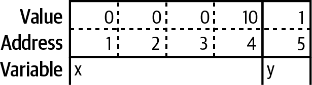
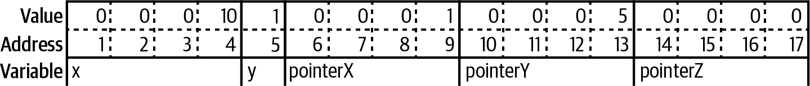
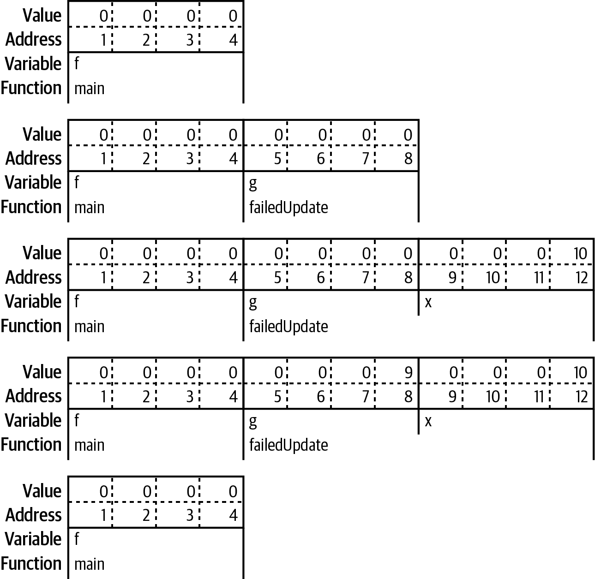
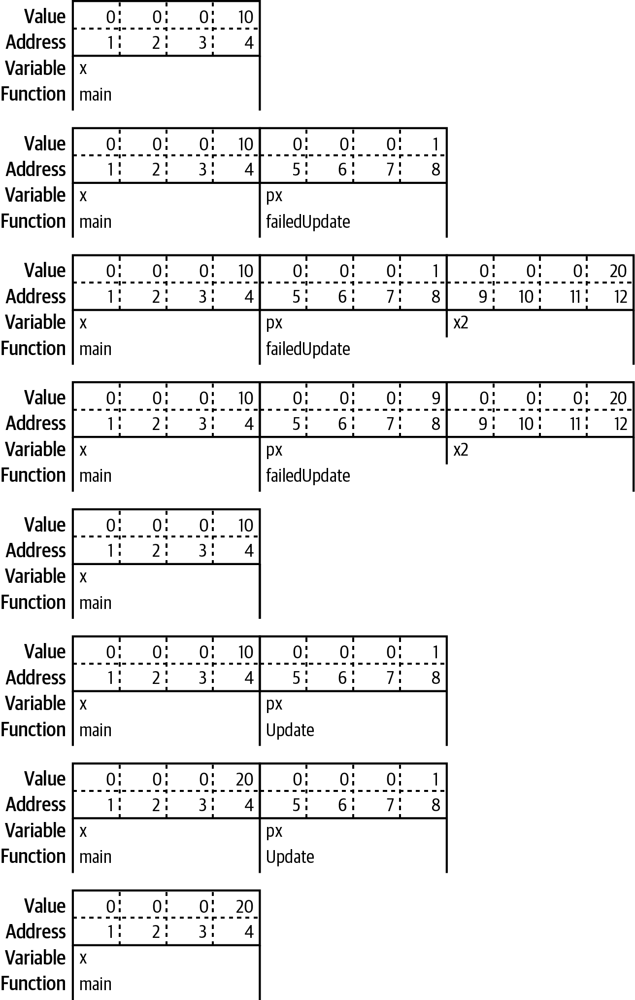

# Pointers

## A Quick Pointer Primer

Every variable is stored in one or more contiguous memory locations, called _addresses_.

```go
var x int32 = 10
var y bool = true
```



You only need a bit to represent true or false, but the smallest amount of memory that can be independently addressed is
a byte.

A pointer is simply a variable whose contents are the address where another variable is stored.

```go
var x int32 = 10
var y bool = true
pointerX := &x
pointerY := &y
var pointerZ *string
```



While different types of variables can take up different numbers of memory locations, every pointer, no matter what type
it is pointing to, is always the same size.

The zero value for a pointer is `nil`.

Slices, maps, functions, channels and interfaces are implemented with pointers.

_pointer arithmetic_, are not allowed in Go.

The `&` is the _address_ operator.

The `*` is the _indirection_ operator. It precedes a variable of pointer type and returns the pointed-to value. This is
called _dereferencing_:

```go
x := 10
pointerX := &x
fmt.Println(pointerX) // prints a memory address
fmt.Println(*pointerX) // prints 10
z := 5 + *pointerX
fmt.Println(z) // prints 15
```

Your program will panic if you attempt to dereference a `nil` pointer:

```go
var x *int
fmt.Println(x == nil) // prints true
fmt.Println(*x) // panics
```

A _pointer type_ is a type that represents a pointer.

```go
x := 0
var pointerToX *int
pointerToX = &x
```

The built-in function `new` creates a pointer variable. It returns a pointer to a zero value instance of the provided
type:

```go
var pointer = new(int)
fmt.Println(pointer == nil) // prints false
fmt.Println(*pointer) // prints 0
```

The `new` function is rarely used.

You can’t use an & before a primitive literal (numbers, booleans, and strings) or a constant because they don’t have
memory addresses; they exist only at compile time.

If you have a struct with a field of a pointer to a primitive type, you can’t assign a literal directly to the field:

```go
type person struct {
    FirstName string
    MiddleName *string
    LastName string
}
p := person{
    FirstName: "Pat",
    MiddleName: "Perry", // This line won't compile
    LastName: "Peterson",
}
```

Compiling this code returns the error:

```
cannot use "Perry" (type string) as type *string in field value
```

If you try to put an & before "Perry", you’ll get the error message:

```
cannot take the address of "Perry"
```

There are two ways around this problem. The first is to introduce a variable to hold the constant value. The second way
is to write a helper function that takes in a boolean, numeric, or string type and returns a pointer to that type:

```go
func stringp(s string) *string {
    return &s
}
```

With that function, you can now write:

```go
p := person{
    FirstName: "Pat",
    MiddleName: stringp("Perry"), // This works
    LastName: "Peterson",
}
```

Why does this work? When we pass a constant to a function, the constant is copied to a parameter, which is a variable.
Since it’s a variable, it has an address in memory. The function then returns the variable’s memory address.

## Don't Fear the Pointers

```java
class Foo:
    def __init__(self, x):
        self.x = x

def outer():
    f = Foo(10)

    inner1(f)
    print(f.x)
    
    inner2(f)
    print(f.x)
    
    g = None
    inner2(g)
    print(g is None)

def inner1(f):
    f.x = 20

def inner2(f):
    f = Foo(30)

outer()
```

Running this code prints out:

```
20
20
True
```

That’s because the following things are true in Java, Python, JavaScript, and Ruby:

- If you pass an instance of a class to a function and you change the value of a field, the change is reflected in the
  variable that was passed in.
- If you reassign the parameter, the change is not reflected in the variable that was passed in.
- If you pass `nil/null/None` for a parameter value, setting the parameter itself to a new value doesn’t modify the
  variable in the calling function.

Some people explain this behavior by saying that class instances are passed by reference in these languages. This is
untrue. If they were being passed by reference, cases two and three would change the variable in the calling function.
These languages are always pass-by-value, just like Go.

What we are seeing is that every instance of a class in these languages is implemented as a pointer. When a class
instance is passed to a function or method, the value being copied is the pointer to the instance. When inner2 reassigns
f to a new class instance, this creates a separate instance and does not affect the variable in outer.

The difference between Go and these languages is that Go gives you the choice to use pointers or values for both
primitives and structs. Most of the time, you should use a value. They make it easier to understand how and when your
data is modified. A secondary benefit is that using values reduces the amount of work that the garbage collector has to
do.

## Pointers Indicate Mutable Parameters

MIT’s course on [Software Construction](http://web.mit.edu/6.031/www/fa20/classes/08-immutability/) sums up the reasons
why: “Immutable types are safer from bugs, easier to understand, and more ready for change. Mutability makes it harder
to understand what your program is doing, and much harder to enforce contracts. Using mutable objects is just fine if
you are using them entirely locally within a method, and with only one reference to the object”

The lack of immutable declarations in Go might seem problematic, but the ability to choose between value and pointer
parameter types addresses the issue.

Since Go is a call by value language, the values passed to functions are copies. For nonpointer types like primitives,
structs, and arrays, this means that the called function cannot modify the original.

However, if a pointer is passed to a function, the function gets a copy of the pointer. This still points to the
original data, which means that the original data can be modified by the called function.

The first implication is that when you pass a `nil` pointer to a function, you cannot make the value non-nil. You can
only reassign the value if there was a value already assigned to the pointer.

```go
func failedUpdate(g *int) {
  x := 10
  g = &x
}

func main() {
  var f *int // f is nil
  failedUpdate(f)
  fmt.Println(f) // prints nil
}
```



The second implication is that if you want the value assigned to a pointer parameter to still be there when you exit the
function, you must dereference the pointer and set the value. If you change the pointer, you have changed the copy, not
the original.

```go
func failedUpdate(px *int) {
  x2 := 20
  px = &x2
}

func update(px *int) {
  *px = 20
}

func main() {
  x := 10
  failedUpdate(&x)
  fmt.Println(x) // prints 10
  update(&x)
  fmt.Println(x) // prints 20
}
```


