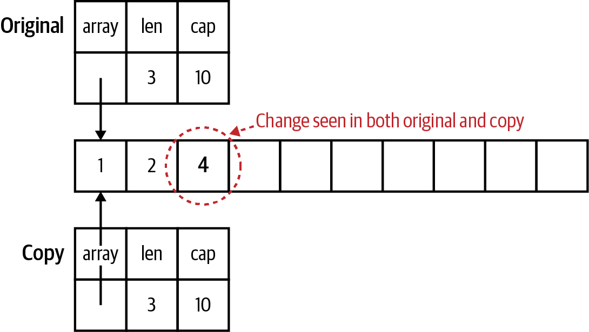
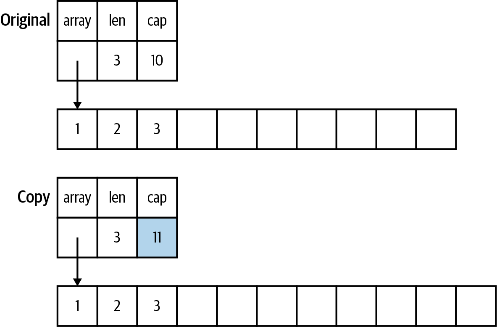
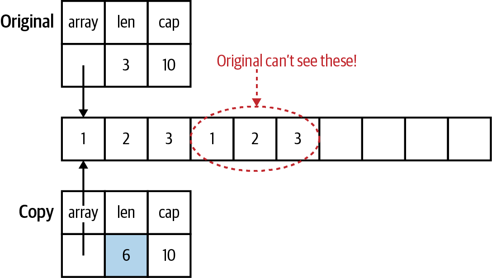

# Pointers

## A Quick Pointer Primer

Every variable is stored in one or more contiguous memory locations, called _addresses_.

```go
var x int32 = 10
var y bool = true
```


You only need a bit to represent true or false, but the smallest amount of memory that can be independently addressed is
a byte.

A pointer is simply a variable whose contents are the address where another variable is stored.

```go
var x int32 = 10
var y bool = true
pointerX := &x
pointerY := &y
var pointerZ *string
```


While different types of variables can take up different numbers of memory locations, every pointer, no matter what type
it is pointing to, is always the same size.

The zero value for a pointer is `nil`.

Slices, maps, functions, channels and interfaces are implemented with pointers.

_pointer arithmetic_, are not allowed in Go.

The `&` is the _address_ operator.

The `*` is the _indirection_ operator. It precedes a variable of pointer type and returns the pointed-to value. This is
called _dereferencing_:

```go
x := 10
pointerX := &x
fmt.Println(pointerX) // prints a memory address
fmt.Println(*pointerX) // prints 10
z := 5 + *pointerX
fmt.Println(z) // prints 15
```

Your program will panic if you attempt to dereference a `nil` pointer:

```go
var x *int
fmt.Println(x == nil) // prints true
fmt.Println(*x) // panics
```

A _pointer type_ is a type that represents a pointer.

```go
x := 0
var pointerToX *int
pointerToX = &x
```

The built-in function `new` creates a pointer variable. It returns a pointer to a zero value instance of the provided
type:

```go
var pointer = new(int)
fmt.Println(pointer == nil) // prints false
fmt.Println(*pointer) // prints 0
```

The `new` function is rarely used.

You can’t use an & before a primitive literal (numbers, booleans, and strings) or a constant because they don’t have
memory addresses; they exist only at compile time.

If you have a struct with a field of a pointer to a primitive type, you can’t assign a literal directly to the field:

```go
type person struct {
    FirstName string
    MiddleName *string
    LastName string
}
p := person{
    FirstName: "Pat",
    MiddleName: "Perry", // This line won't compile
    LastName: "Peterson",
}
```

Compiling this code returns the error:

```
cannot use "Perry" (type string) as type *string in field value
```

If you try to put an & before "Perry", you’ll get the error message:

```
cannot take the address of "Perry"
```

There are two ways around this problem. The first is to introduce a variable to hold the constant value. The second way
is to write a helper function that takes in a boolean, numeric, or string type and returns a pointer to that type:

```go
func stringp(s string) *string {
    return &s
}
```

With that function, you can now write:

```go
p := person{
    FirstName: "Pat",
    MiddleName: stringp("Perry"), // This works
    LastName: "Peterson",
}
```

Why does this work? When we pass a constant to a function, the constant is copied to a parameter, which is a variable.
Since it’s a variable, it has an address in memory. The function then returns the variable’s memory address.

## Don't Fear the Pointers

```java
class Foo:
    def __init__(self, x):
        self.x = x

def outer():
    f = Foo(10)

    inner1(f)
    print(f.x)
    
    inner2(f)
    print(f.x)
    
    g = None
    inner2(g)
    print(g is None)

def inner1(f):
    f.x = 20

def inner2(f):
    f = Foo(30)

outer()
```

Running this code prints out:

```
20
20
True
```

That’s because the following things are true in Java, Python, JavaScript, and Ruby:

- If you pass an instance of a class to a function and you change the value of a field, the change is reflected in the
  variable that was passed in.
- If you reassign the parameter, the change is not reflected in the variable that was passed in.
- If you pass `nil/null/None` for a parameter value, setting the parameter itself to a new value doesn’t modify the
  variable in the calling function.

Some people explain this behavior by saying that class instances are passed by reference in these languages. This is
untrue. If they were being passed by reference, cases two and three would change the variable in the calling function.
These languages are always pass-by-value, just like Go.

What we are seeing is that every instance of a class in these languages is implemented as a pointer. When a class
instance is passed to a function or method, the value being copied is the pointer to the instance. When inner2 reassigns
f to a new class instance, this creates a separate instance and does not affect the variable in outer.

The difference between Go and these languages is that Go gives you the choice to use pointers or values for both
primitives and structs. Most of the time, you should use a value. They make it easier to understand how and when your
data is modified. A secondary benefit is that using values reduces the amount of work that the garbage collector has to
do.

## Pointers Indicate Mutable Parameters

MIT’s course on [Software Construction](http://web.mit.edu/6.031/www/fa20/classes/08-immutability/) sums up the reasons
why: “Immutable types are safer from bugs, easier to understand, and more ready for change. Mutability makes it harder
to understand what your program is doing, and much harder to enforce contracts. Using mutable objects is just fine if
you are using them entirely locally within a method, and with only one reference to the object”

The lack of immutable declarations in Go might seem problematic, but the ability to choose between value and pointer
parameter types addresses the issue.

Since Go is a call by value language, the values passed to functions are copies. For nonpointer types like primitives,
structs, and arrays, this means that the called function cannot modify the original.

However, if a pointer is passed to a function, the function gets a copy of the pointer. This still points to the
original data, which means that the original data can be modified by the called function.

The first implication is that when you pass a `nil` pointer to a function, you cannot make the value non-nil. You can
only reassign the value if there was a value already assigned to the pointer.

```go
func failedUpdate(g *int) {
  x := 10
  g = &x
}

func main() {
  var f *int // f is nil
  failedUpdate(f)
  fmt.Println(f) // prints nil
}
```


The second implication is that if you want the value assigned to a pointer parameter to still be there when you exit the
function, you must dereference the pointer and set the value. If you change the pointer, you have changed the copy, not
the original.

```go
func failedUpdate(px *int) {
  x2 := 20
  px = &x2
}

func update(px *int) {
  *px = 20
}

func main() {
  x := 10
  failedUpdate(&x)
  fmt.Println(x) // prints 10
  update(&x)
  fmt.Println(x) // prints 20
}
```


## Pointer Passing Performance

The time to pass a pointer into a function is constant for all data sizes, roughly one nanosecond. This makes sense, as
the size of a pointer is the same for all data types. Passing a value into a function takes longer as the data gets
larger. It takes about a millisecond once the value gets to be around 10 megabytes of data.

For data structures that are smaller than a megabyte, it is actually slower to return a pointer type than a value type.
For example, a 100-byte data structure takes around 10 nanoseconds to be returned, but a pointer to that data structure
takes about 30 nano‐seconds. Once your data structures are larger than a megabyte, the performance advantage flips. It
takes nearly 2 milliseconds to return 10 megabytes of data, but a little more than half a millisecond to return a
pointer to it.

## The Zero Value Versus No Value

The other common usage of pointers in Go is to indicate the difference between a variable or field that’s been assigned
the zero value and a variable or field that hasn't been assigned a value at all.

When converting data back and forth from JSON, use a pointer value for fields in the struct that are nullable.

## The Difference Between Maps and Slices

Within the Go runtime, a map is implemented as a pointer to a struct. Passing a map to a function means that you are
copying a pointer.

You should avoid using maps for input parameters or return values, especially on public APIs. Rather than passing a map
around, use a struct.

1. From the standpoint of immutability, maps are bad because the only way to know what ended up in the map is to trace
   through all of the functions that interact with it.
2. [Reducing the garbage collector's workload](#reducing-the-garbage-collectors-workload)

A slice is implemented as a struct with three fields: an int field for length, an int field for capacity, and a pointer
to a block of memory.

Changing the values in the slice changes the memory that the pointer points to, so the changes are seen in both the copy
and the original.



Changes to the length and capacity are not reflected back in the original, because they are only in the copy. Changing
the capacity means that the pointer is now pointing to a new, bigger block of memory.



If the slice copy is appended to and there is enough capacity to not allocate a new slice, the length changes in the
copy and the new values are stored in the block of memory that’s shared by the copy and the original. However, the
length in the original slice remains unchanged. This means the Go runtime prevents the original slice from seeing those
values since they are beyond the length of the original slice.



## Slices as Buffers

When reading data from an external resource (like a file or a network connection), many languages use code like this:

```
r = open_resource()
while r.has_data() {
    data_chunk = r.next_chunk()
    process(data_chunk)
}
close(r)
```

The problem with this pattern is that every time we iterate through that while loop, we allocate another data_chunk even
though each one is only used once. This creates lots of unnecessary memory allocations. Garbage-collected languages
handle those allocations for you automatically, but the work still needs to be done to clean them up when you are done
processing.

Even though Go is a garbage-collected language, writing idiomatic Go means avoiding unneeded allocations. Rather than
returning a new allocation each time we read from a data source, we create a slice of bytes once and use it as a buffer
to read data from the data source:

```go
file, err := os.Open(fileName)
if err != nil {
    return err
}
defer file.Close()
data := make([]byte, 100)
for {
    count, err := file.Read(data)
    if err != nil {
        return err
    }
    if count == 0 {
            return nil
    }
    process(data[:count])
}
```

In this code, we create a buffer of 100 bytes and each time through the loop, we copy the next block of bytes (up to 100
bytes) into the slice. We then pass the populated portion of the buffer to function. By using buffers we reduce the work
done by the garbage collector.

## Reducing the Garbage Collector’s Workload

When programmers talk about “garbage” what they mean is “data that has no more pointers pointing to it.” Once there are
no more pointers pointing to some data, the memory that this data takes up can be reused. If the memory isn’t recovered,
the program’s memory usage would continue to grow until the computer ran out of RAM. The job of a garbage collector is
to automatically detect unused memory and recover it so it can be reused.

A [_stack_](https://www.youtube.com/watch?v=IX3fDYz0WyM) is a consecutive block of memory, and every function call in
thread of execution shares the same stack. Allocating memory on the stack is fast and simple. A stack pointer tracks the
last location where memory was allocated; allocating additional memory is done by moving the stack pointer. When a
function is invoked, a new stack frame is created for the function’s data. Local variables are stored on the stack,
along with parameters passed into a function. Each new variable moves the stack pointer by the size of the value. When a
function exits, its return values are copied back to the calling function via the stack and the stack pointer is moved
back to the beginning of the stack frame for the exited function, deallocating all of the stack memory that was used by
that function’s local variables and parameters.

> Go is unusual in that it can actually increase the size of a stack while the program is running. This is possible
> because each goroutine has its own stack and goroutines are managed by the Go runtime, not by the underlying operating
> system. This has advantages (Go stacks start small and use less memory) and disadvantages (when the stack needs to grow,
> all of the data on the stack needs to be copied, which is slow)

To store something on the stack, you have to know exactly how big it is at compile time. When you look at the value
types in Go (primitive values, arrays, and structs), they all have one thing in common: we know exactly how much memory
they take at compile time. Because their sizes are known, they can be allocated on the stack instead of the heap. The
size of a pointer type is also known, and it is also stored on the stack.

The rules are more complicated when it comes to the data that the pointer points to. In order for Go to allocate the
data the pointer points to on the stack, several conditions must be true. It must be a local variable whose data size is
known at compile time. The pointer cannot be returned from the function. If the pointer is passed into a function, the
compiler must be able to ensure that these conditions still hold.

When the compiler determines that the data can’t be stored on the stack, we say that the data the pointer points to
_escapes_ the stack and the compiler stores the data on the heap.

The _heap_ is the memory that’s managed by the garbage collector.

Any data that’s stored on the heap is valid as long as it can be tracked back to a pointer type variable on a stack.
Once there are no more pointers pointing to that data (or to data that points to that data), the data becomes garbage
and it’s the job of the garbage collector to clear it out.

> A common source of bugs in C programs is returning a pointer to a local variable. In C, this results in a pointer
> pointing to invalid memory. The Go compiler is smarter. When it sees that a pointer to a local variable is returned, the
> local variable’s value is stored on the heap.

The _escape analysis_ done by the Go compiler isn’t perfect. There are some cases where data that could be stored on the
stack escapes to the heap.

You might be wondering: what’s so bad about storing things on the heap? There are two problems related to performance:

1. First is that the garbage collector takes time to do its work. It isn’t trivial to keep track of all of the available
   chunks of free memory on the heap or tracking which used blocks of memory still have valid pointers. This is time
   that’s taken away from doing the processing that your program is written to do. Many garbage collection algorithms
   have been written, and they can be placed into two rough categories: those that are designed for higher throughput
   (find the most garbage possible in a single scan) or lower latency (finish the garbage scan as quickly as possible).
   The garbage collector used by the Go runtime favors low latency. Each garbage collection cycle is designed to take
   less than 500 microseconds. However, if your Go program creates lots of garbage, then the garbage collector won’t be
   able to find all of the garbage during a cycle, slowing down the collector and increasing memory usage.
2. The second problem deals with the nature of computer hardware. RAM might mean “random access memory,” but the fastest
   way to read from memory is to read it sequentially. A slice of structs in Go has all of the data laid out
   sequentially in memory. This makes it fast to load and fast to process. A slice of pointers to structs (or structs
   whose fields are pointers) has its data scattered across RAM, making it far slower to read and process. Forrest Smith
   wrote an in-depth [blog post](https://www.forrestthewoods.com/blog/memory-bandwidth-napkin-math/) that explores how
   much this can affect performance. His numbers indicate that it’s roughly two orders of magnitude slower to access
   data via pointers that are stored randomly in RAM.

In Java, local variables and parameters are stored in the stack, just like Go. However, as we discussed earlier, objects
in Java are implemented as pointers. That means for every object variable instance, only the pointer to it is allocated
on the stack; the data within the object is allocated on the heap. Only primitive values (numbers, booleans, and chars)
are stored entirely on the stack. This means that the garbage collector in Java has to do a great deal of work.

Now you can see why Go encourages you to use pointers sparingly. We reduce the workload of the garbage collector by
making sure that as much as possible is stored on the stack. Slices of structs or primitive types have their data lined
up sequentially in memory for rapid access.

If you are interested in the implementation details, you may want to listen to the talk Rick Hudson gave at the
International Symposium on Memory Management in 2018, describing
the [history and implementation](https://go.dev/blog/ismmkeynote) of the Go garbage collector.

If you want to learn more about heap versus stack allocation and escape analysis in Go, there are excellent blog posts
that cover the topic, including ones by
[William Kennedy](https://www.ardanlabs.com/blog/2017/05/language-mechanics-on-stacks-and-pointers.html) of Arden Labs
and [Achille Roussel](https://segment.com/blog/allocation-efficiency-in-high-performance-go-services/) and Rick Branson
of Segment.

